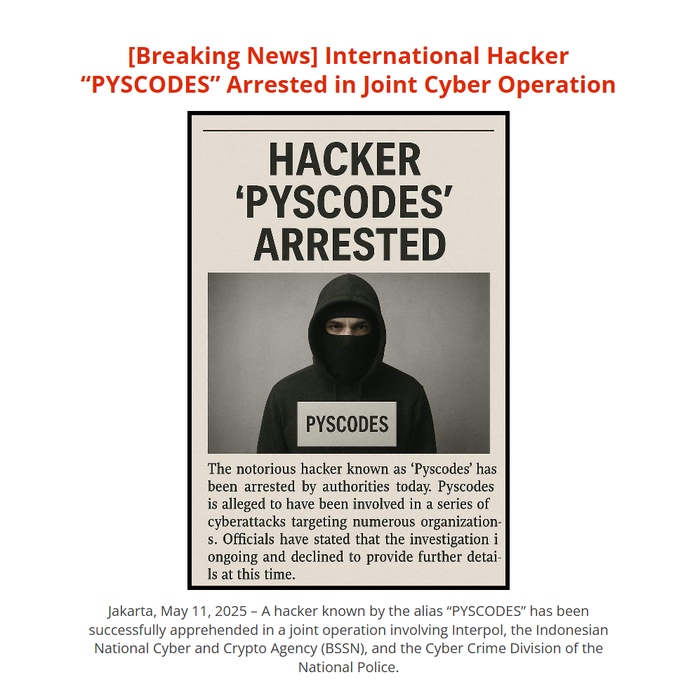

# PussyCodes

A satirical website mocking script kiddies who pretend to be elite hackers.

## Features

- Matrix rain animation background
- Glitch text effects
- Fake hacker profile and criminal record
- Animated skill bars
- Terminal-style window with fake commands
- Mock code snippets and news sections
- Custom rap diss track (audio)
- Responsive, neon-styled design

## Project Structure

```
index.html                # Main HTML file
assets/
  css/style.css           # Main stylesheet
  img/                    # Images (profile, fake news, etc.)
  sounds/                 # Audio (diss track)
```

## How to Run

Just open `index.html` in your browser. No build or server required.

## Screenshots



## Credits

- Design & Code: Satirical, for fun only
- Audio: Custom diss track in `assets/sounds/`
- Images: Parody, not real people

## Disclaimer

This project is for entertainment and parody purposes only. No real hacking, no real criminals, just jokes.
